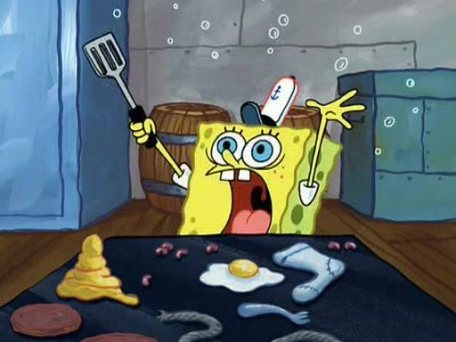

+++
title = 'Routine'
date = 2024-10-25
draft = false
summary = "One time I decided to build my _dream_ car"
featured_image = "images/gti.jpg"
section = "posts"
+++

For the last months, I've felt like not doing enough, days were a drag and simply, everything was hard. There's an episode in Spongebob Squarepants where Bob forgets how to prepare a Krabby Patty; pretty much that's how I felt: I've done for over 10 years and I'm struggling.

{.inline-img}

I feel like going nowhere. What I'm doing in my days (or I think I'm doing) is not getting me closer to where I want to go.

(I) Maybe I should consider creating a routine but no, that's not for me, I like to have my days open so I can do infinite stuff instead of sticking to what a calendar says.

(II) I don't like to plan things, I like to adapt to how the day's going and flow with it.

We're what we do. We're our habits. Yes, I read Atomic Habits recently, and that made me think of what I am, how am I doing it, and basically, who I am.

I don't have attention. Look a fluffy dog!

This week I decided to make a routine and give it a try. Today is 5:38am, is the third day, and here's how my routine looks like:

#### 6:15-6:45 Reading a Book

I want to make learning a habit. Also, I find the _task_ of reading a bit difficult, after a few minutes, its easy for me to start thinking in things, to drift apart from the lecture so, the constant practice of reading helps me to keep myself focused in one activity. I try to read at least 20 pages every day.

#### 6:45-7:10 Prepare + Dog

Get dressed to take daughter to school AND take the dog out. Nothing too complex here, nothing to think about. The other day I decided I would _always_ wear a Railway hoodie and sweat pants when taking my daughter to school.

#### 7:10-8:00 School ride

Love driving. This is just an early opportunity to do it. After dropping my daughter at school, we drive for a little, just enjoying the streets before they get dense with traffic.

#### 8:00-9:00 Exercise

I try to not be a couch potato. I know I'm a nerd and I spend all my day in front of a computer and I've accumulated a few extra kilos around my waistline. Plus, I want to run 5K casually, any day of the week, this is what I'm working towards to.
Also, I'm terrible at doing something in a paced fashion, I like to go intense, suffer, and then quit to later regret it. This time I'm trying to break the cycle.

> If I have the opportunity to think about it and somehow avoid doing it, guess what? I'm not going to do it—path of least resistance—BUT if its _already there_ before I start thinking about it, I'll just start doing it.

##### 9:00-9:30 Breakfast

Self-explanatory. We all need food in the morning.

_work day starts at 9:30_

##### 9:30-10:00 Discord Catchup / Planning

First thing of the day: see what happened while you were away, guestimate what are you going to do during the day

##### 10:00-12:00 Hard rocks (I)

The most important thing in the day. If I don't do anything else, I should feel fine knowing I made progress.

##### 12:00—1:00 Thinking Walk

BREAK, take time to decompress and let your subconscious digest the information you absorbed and let it marinate for a bit on it. Once you get back you'll have a better idea.

##### 1:00-3:00 Hard Rocks (II)

2-hour continuation of the first block.

**3:00-4:00 Lunch + Family catchup**
Yup, I like lunch.

**4:00-6:00 Playtime**
Here's what I put things that aren't the most important thing I could do, stakes are low, and this is my play time to keep my creative practice alive.

6:00 - 6:30 Journaling
Stop all the work, start writing how your day was. What parts you liked, what parts you didn't, the struggles, all of that.

6:30 - 7:00 Wrap-o-clock
Posting an update in our Discord channel named "daily-wraps" means I've finished my work day and I disconnect.

7:00 - 8:00 Personal time (I)
Basically, time for side projects, writing, or just consuming internet unproductively.

8:00 - 8:30 Dinner
8:30 - 8:45 Take dog out
8:45 - 10:00 Personal Time (II)

## How is this tied to my goals

## Finality
