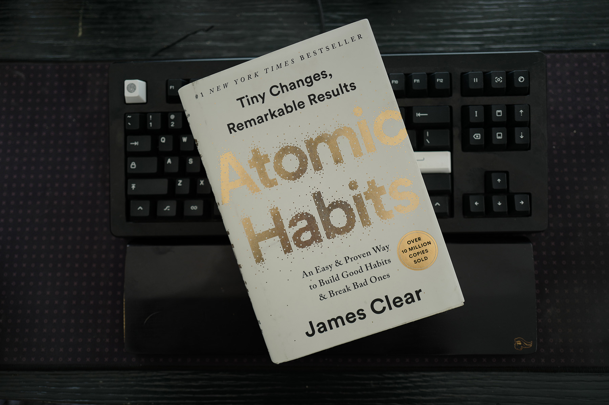

+++
title = 'Changing habits and identity rebalance'
date = 2024-07-05
draft = false
summary = "I decided to change my output, started with this book and I think it worked (?)"
+++

  There's a moment when you feel uncomfortable enough with your current situation that you decide to make yourself even more uncomfortable—at fist—to change 

##### Why this book?

**Quick answer:**
I wanted to quit bad habits.

**Long answer:**
I was tired of always having the same output. It took me a couple of years notice how my current routine (inputs and workflows) were producing suboptimal output and change it.

##### Did it work?

Yes. I quit smoking for good, I think. Previously, I've read books about changing habits, some of the elements were there, like "removing the friction to do the thing you wanna do".
