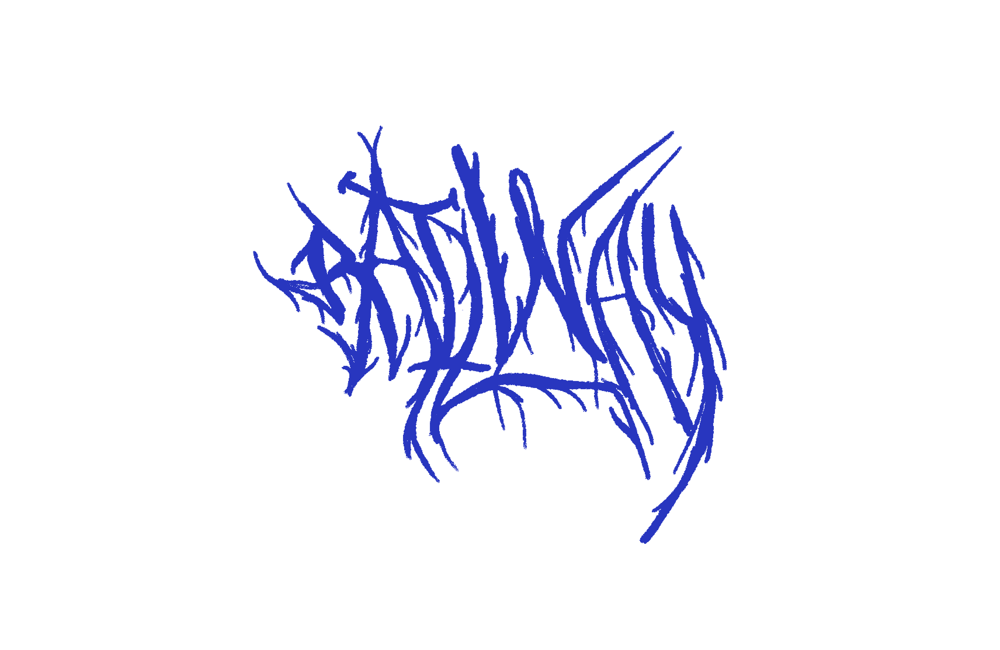
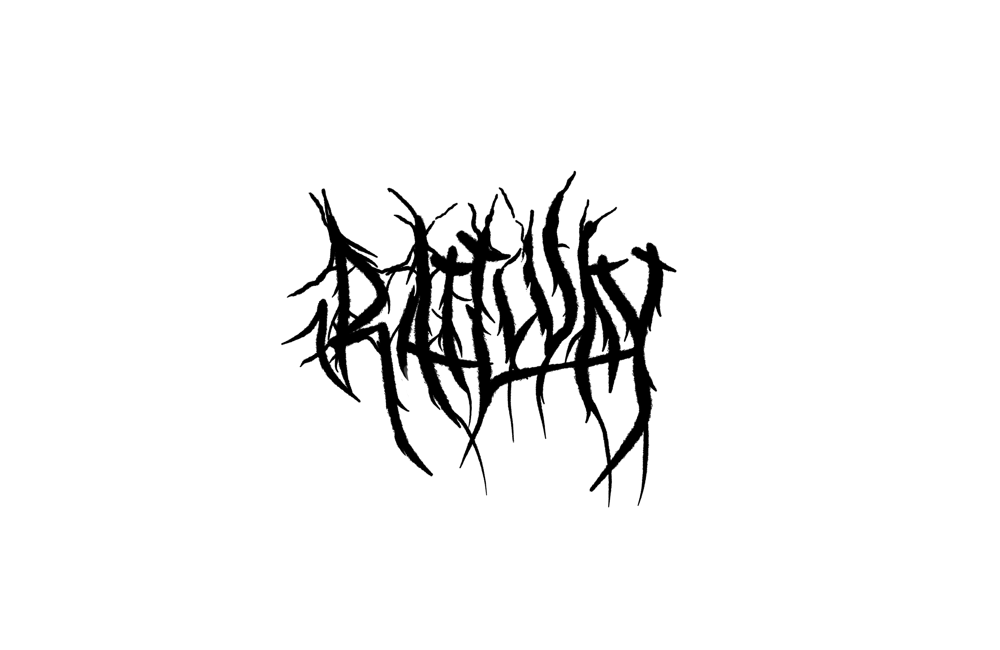

+++
title = 'Railway Metal'
date = 2024-10-25
draft = false
summary = "For the release of our Metal regions, I decided to make a conmemorative tshirt, of course featuring a fake trash metal logo"
featured_image = "images/img-metal.png"
section = "posts"
category = "Work"
+++

"One day we will migrate off Google Cloud and build our own cloud"  
—_we, years ago_.

In April of 2025, we deployed our first set of bare metal servers across 4 different regions: US-East, US-West, Singapore, and Amsterdam. Finally, we have servers; allowing us to control the entire stack: Servers, Network, Builder, Deployment Pipeline, and Control Layer (aka GUI).

Being bare metal a big deal, I wanted to have fun with the metal part and told myself: It would be super cool to have a _metal_ band-like t-shirt. Because yeah, we all like to look though, badass one day every month.

I like letters, I like _typography_. Side story: during high school, some became emo, dark, or some other urban tribe; I used to graciously decorate city walls with spray paint. Some times appreciated, some others chased. I decided to give it a go, how hard can it be, right?

I don't know how the greatest end result looks _now_, but I know that it needs to be readable. You have Metallica's sharp geometric lines in one end, and unreadable bushes with spikes in the other.

### Let the iterations begin

It started with this quick version trying to intertwine the letters, bend them, look for ways to reshape the character's structure

I start to understand how each stroke interacts with each other. This level of noise is not my favorite, but we're in the exploration phase.

Pulling back on the noise and going with the organic structure, this version was somehow interesting. It could be something but it's not quite there yet.
