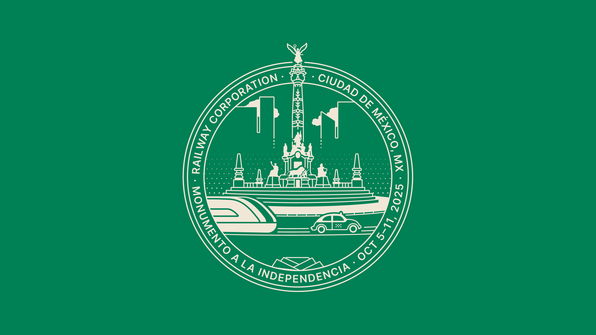

+++
title = 'Railway → México City'
date = 2024-10-26
draft = false
section = "posts"
category = "Illustration"
featured_image = "images/cdmx-2x-cover.png"
+++

At Railway, we have the tradition of making a location-specific artwork for every trip. In the past, we have visited Hawaii, Dubai, Bali, New Orleans, New Buffalo, La Palma (Spain), Lisbon, and for this last edition, we visited Mexico City.

The artwork formula is simple, picture the Railway train arriving to the retreat location. Ideally, use a recognizable monument and shove a train.

For Mexico City, I chose the Angel de la Independencia as the center piece of the artwork. Not all places have a relevant piece of architecture, some of them are just normal buildings.

Next step is to find a good reference photo. Ideally at ground level. And start tracing. Knowing the line is not thin, reducing the amount of detail is important to keep the artwork readable.
