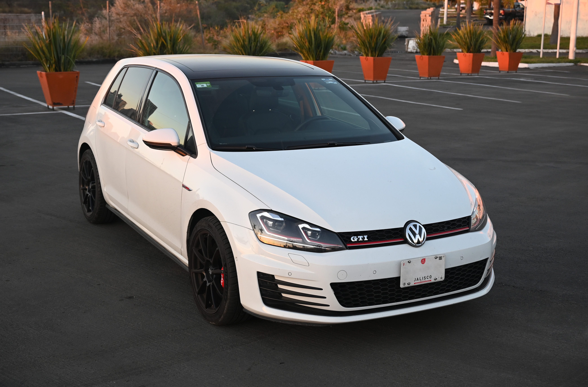
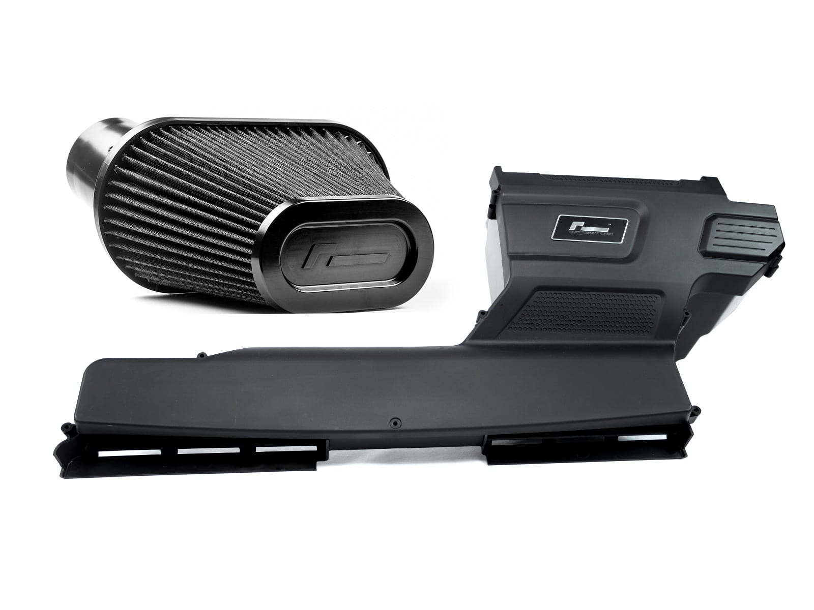
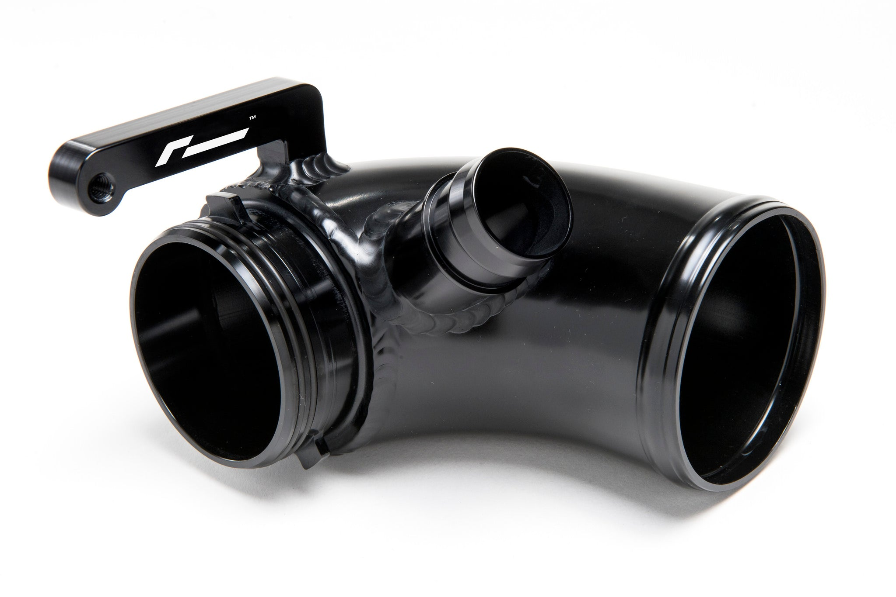
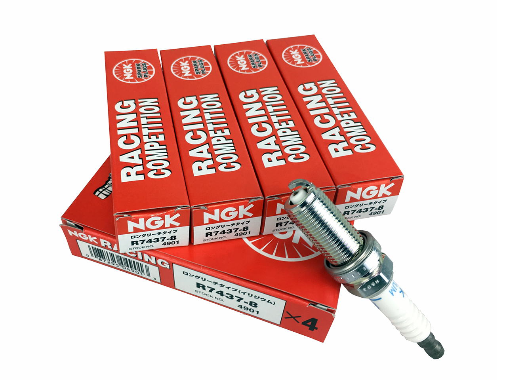
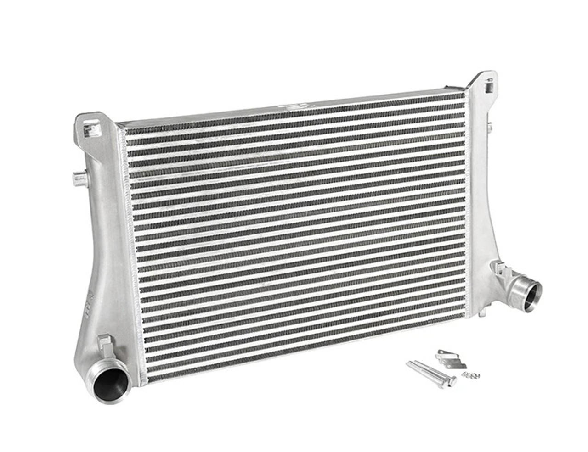
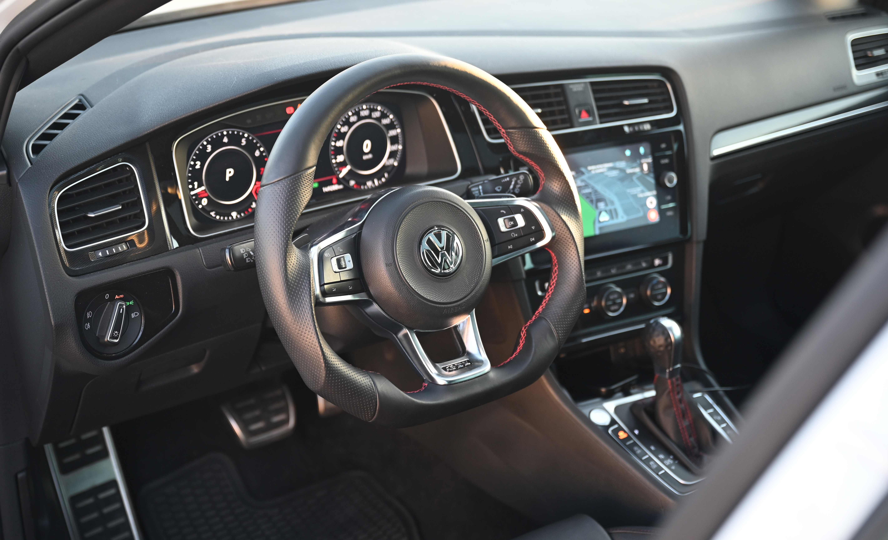

+++
title = 'GTI MK7 Build'
date = 2024-03-05
draft = false
summary = "One time I decided to build my _dream_ car"
+++

<p class="large">We choose to go to the moon. We choose to go to the moon in this decade and do the other things, not because they are easy, but because they are hard, because that goal will serve to organize and measure the best of our energies and skills.</p>



#### Performance Upgrades

It is for these reasons that I regard the decision last year to shift our efforts in space from low to high gear as among the most important decisions that will be made during my incumbency in the office of the Presidency.

- APR Engine (ECU) Tune Stage 1
- APR Transmission (TCU) Tune Stage 1
- NGK Performance Spark Plugs
- Racingline R600 Closed Intake
- Racingline Turbo inlet pipe & hoses
- APR Turbo muffler delete
- Integrated Engineering Performance Intercooler

<div class="flex">
<div class="col-left">



</div>  
<div class="col-right">



</div>
</div>
<div class="flex">
<div class="col-left">



</div>  
<div class="col-right">



</div>
</div>

These two things took the car from 220HP stock to whooping 316HP. Allegedly, never have taken it to a Dyno. It seems a great idea until you face...ahem, WHEELHOP!

---

#### Handling Upgrades

- KW Street Comfort Coilovers
- H&R Anti-sway bars (26mm front/24mm back, solid)
- Brembo GT 4-piston Brakes
- Michelin Pilot Sport 5 235x35/r18
- ECS Tunning Dogbone Mount
- 034 Motorsports Front/Back Endlinks


#### Interior Upgrades

- Hexcarbon Custom Steering Wheel (Napa/Perforated Leather)
- OEM Digital Cockpit
- OEM 7.5” Entertainment System
- OEM DSG Anniversary Golf Ball Shifter
- Audison Subwoofer
- Monster GTI Mats



###### H6 › Small Title

---

###### Unordered list:

- List level 01
  - Inner list item A
  - Inner list item B
  - Inner list item C
- List level 02
- List level 03

Ordered list:

1. This is the item number 01

> Blockquote

`inline code` with backticks

---

```
This is a block
How about some mono style?
How about some mono style?
```
