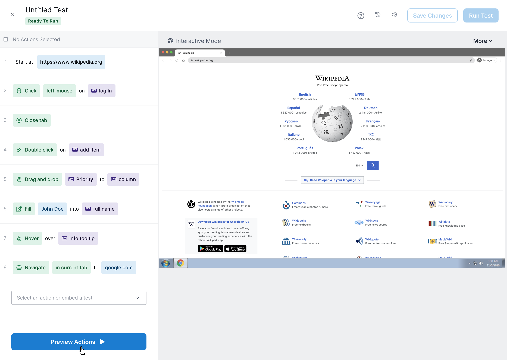

+++
title = 'Rainforest'
date = 2024-03-05
summary = "Senior Product Designer ft Software QA"
featured_image = "images/rainforest.png"
section = "work"
draft = false
+++

<!-- 
We choose to go to the moon. We choose to go to the moon in this decade and do the other things, not because they are easy, but because they are hard, because that goal will serve to organize and measure the best of our energies and skills.
 -->

#### Performance Upgrades

It is for these reasons that I regard the decision last year to shift our efforts in space from low to high gear as among the most important decisions that will be made during my incumbency in the office of the Presidency.

- APR Engine (ECU) Tune Stage 1
- APR Transmission (TCU) Tune Stage 1
- NGK Performance Spark Plugs
- Racingline R600 Closed Intake
- Racingline Turbo inlet pipe & hoses
- APR Turbo muffler delete
- Integrated Engineering Performance Intercooler
